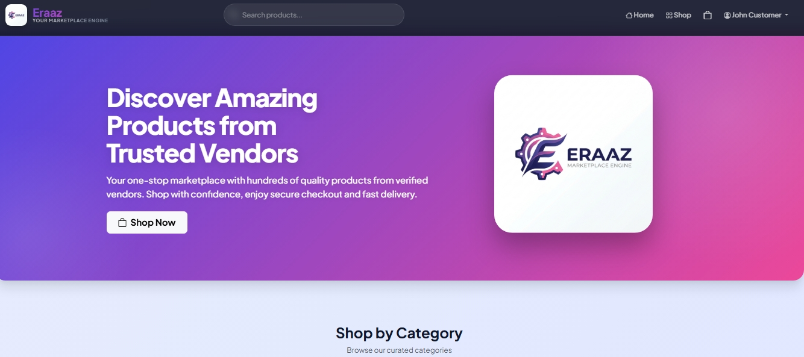

# 🛒 Eraaz Marketplace

A full-featured **multi-vendor e-commerce platform** built with Laravel, designed to handle real-world business workflows including vendor management, order processing, and admin control.

---
## 📸 Screenshots

 
* Product Listing
* Vendor Dashboard
* Admin Panel
## 🚀 Overview

Eraaz Marketplace enables multiple vendors to sell products on a single platform while providing customers with a smooth shopping experience and admins with complete system control.

This project demonstrates full-stack development, scalable backend architecture, and real-world application logic.

---

## 🔥 Key Features

### 👤 Authentication & Roles

* Role-based authentication (Admin / Vendor / Customer)
* Secure login & registration system

### 🏪 Vendor System

* Vendor dashboard
* Product management (add, update, delete)
* Order tracking

### 🛒 Customer Experience

* Browse products by categories
* Add to cart & checkout
* Order placement and tracking

### 👨‍💼 Admin Panel

* Manage users, vendors, and products
* Monitor orders and system activity
* Full control over marketplace

### 💳 Payment System

* Payment fields integrated in order system
* Ready for payment gateway integration (Stripe / JazzCash / Easypaisa)

---

## 🛠️ Tech Stack

### ⚙️ Backend

* PHP
* Laravel (MVC Architecture)

### 🎨 Frontend

* HTML5, CSS3, JavaScript
* Blade Templating Engine
* Bootstrap (Responsive UI)

### 🗄️ Database

* MySQL


---

## ⚙️ Installation

### 1. Clone the repository

```bash
git clone https://github.com/Samhey-0/eraaz-marketplace.git
cd eraaz-marketplace
```

### 2. Install dependencies

```bash
composer install
npm install
```

### 3. Setup environment

```bash
cp .env.example .env
php artisan key:generate
```

### 4. Configure database

Update `.env` with your DB credentials

```bash
php artisan migrate
```

### 5. Run the project

```bash
php artisan serve
```

---

## 📈 Project Highlights

* ✔ Full-stack Laravel application
* ✔ Multi-vendor architecture
* ✔ Clean MVC structure
* ✔ Real-world business logic implementation
* ✔ Payment system foundation

---

## 🎯 Future Improvements

* Payment gateway integration (Stripe / JazzCash / Easypaisa)
* API development for mobile apps
* Performance optimization
* Advanced analytics dashboard

---

## 📫 Contact

**Saim Bakhtiar**

* GitHub: https://github.com/Samhey-0

---

## 📄 License

This project is licensed under the MIT License.
